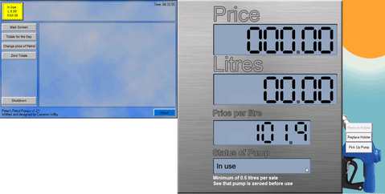

# Petrol Pumps

A petrol pump simulator built with VB6, circa 2008 for an AS level computing course.  

(I was also working at a petrol station at the time, the interface we used was surprisingly similar - clouds and all)

## Features

* Seven segment display powered by a truth table(!)
* Finite state management.
* A lot of blue and nostalgia.

